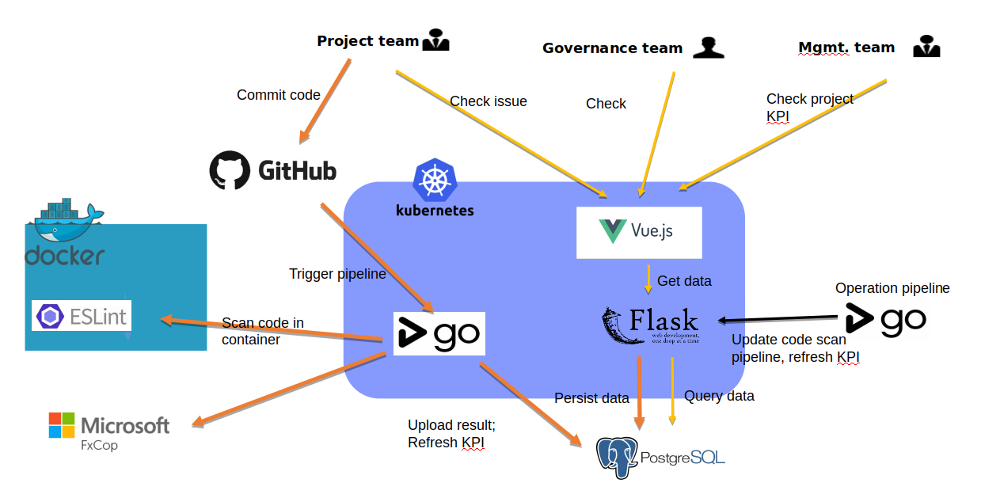
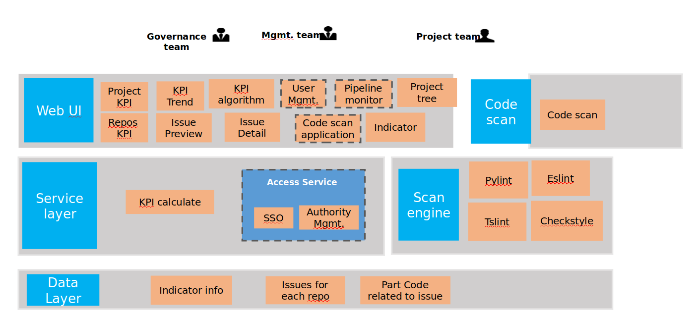

**This repo used to summary my thinking during SEE redesign**

需求：
1. 当前SEE是基于GoCD运行的，需要一个友好的交互界面；
2. 当前SEE只具备基本代码扫描功能，需要实现对Daimler的SDPPS中各项指标的支撑；
3. 需要实现扫描引擎的自由插拔；KPI自由配置；

我的做法：
1. 基于当前架构，增加一个web服务器;GoCD 与web server通过数据库耦合；

2. 设计的思路有些混乱，无法逐步细化;不太清楚如何去画功能示意图

3. 对整个架构设计流程也比较茫然

更好的做法：
1. 确定架构设计目标：功能性，非功能性
2. 绘制总体功能架构和数据流
